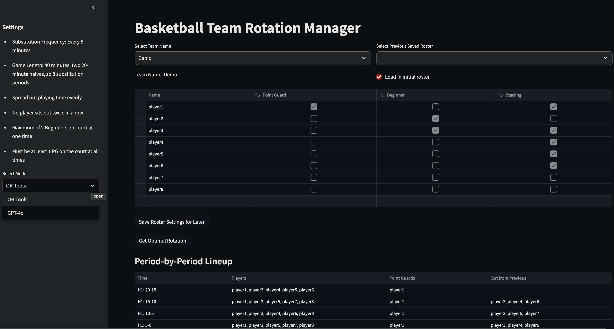

# AI Roster Optimization

A comparison study between OpenAI's o1 model and Google OR-Tools for optimizing basketball team rotations. This project demonstrates how different approaches - a reasoning-focused Large Language Model (LLM) vs traditional optimization libraries - handle complex scheduling constraints for basketball team management.

## Overview

This project solves the challenge of creating optimal player rotations for a basketball team while respecting multiple constraints. It compares two different approaches:
1. Using OpenAI's o1 model - designed for enhanced reasoning capabilities and complex problem-solving
2. Using Google OR-Tools to solve the problem through mathematical optimization

The comparison is particularly interesting as o1 is specifically designed to "spend more time thinking before responding" and has demonstrated strong performance in complex reasoning tasks.



### Problem Description

Given a basketball team roster with:
- Players with designated positions (PG, SG)
- Skill levels (Beginner, Intermediate)
- 40-minute game (20 minutes per half)
- 5-minute rotation periods
- Starting lineup requirements

Key Constraints:
1. Initial period must use the designated starting lineup
2. 20 minutes per half (8 periods of 5 minutes each)
3. Substitutions every 5 minutes
4. At least 1 PG on the court at all times
5. No player can sit out for two consecutive periods
6. Playing time should be balanced (maximum one period difference between players)
7. PG playing time should be balanced
8. 5 players on the court for all periods
9. Equal playing time for all players when possible

## Features

- Interactive web interface using Streamlit
- Side-by-side comparison of solutions from both approaches:
  - o1 model's reasoning-based solution
  - OR-Tools' mathematical optimization solution
- Visual representation of player rotations
- Performance metrics comparison
- Export capabilities for rotation schedules

## Architecture

### Backend Components

- FastAPI backend service
- OpenAI o1 integration via OpenAI API
- OR-Tools optimization engine
- RESTful API endpoints for both solution methods

### Frontend Components

- Streamlit web interface
- Interactive visualization components
- Solution comparison tools

## Installation

1. **Clone the repository:**
   ```bash
   git clone https://github.com/yourusername/ai_roster_optimization
   cd ai_roster_optimization
   ```

2. **Create and configure environment variables:**
   ```bash
   cp example.env dev.env
   ```
   Edit `dev.env` with your settings:
   ```
   BACKEND_HOST=http://<ip_address>:1004/
   OPENAI_API_KEY=your_key_here
   ```

3. **Build and start services:**
   ```bash
   make up
   ```

## Project Structure

```
├── api/                    # FastAPI backend
│   ├── app/
│   │   ├── api/
│   │   │   ├── genai.py   # OpenAI o1 integration
│   │   │   └── main.py    # Main API endpoints
│   └── Dockerfile
├── streamlit/             # Frontend application
│   ├── data/roster/       # Sample data
│   ├── utils/            # Helper functions
│   ├── 🏠_home.py        # Main Streamlit app
│   └── Dockerfile
├── docker-compose-dev.yml
└── Makefile
```

## Usage

1. Access the web interface at `http://<ip_address>:8514`
2. Upload or select a roster file
3. Choose optimization method (OpenAI o1 or OR-Tools)
4. View and compare generated rotation schedules
5. Export results as needed

## Deployment

Deploy to Google Cloud Run:

```bash
gcloud auth login
gcloud config set project <your-project-id>

gcloud builds submit --tag gcr.io/<your-project-id>/streamlit-app

gcloud run deploy streamlit-app \
  --image gcr.io/<your-project-id>/streamlit-app \
  --platform managed \
  --region us-central1 \
  --allow-unauthenticated \
  --port=8080 \
  --timeout=300 \
  --min-instances=1
```

## Makefile Commands

- `make up`: Start all services in development mode
- `make down`: Stop all services
- `make build`: Rebuild containers
- `make logs`: View application logs
- `make test`: Run test suite

## Contributing

Contributions are welcome! Please:

1. Fork the repository
2. Create a feature branch
3. Submit a Pull Request

## License

This project is licensed under the MIT License - see the [LICENSE](LICENSE) file for details.

## Acknowledgements

- OpenAI for the o1 model API
- Google OR-Tools team
- Streamlit for the web framework
- Contributors and testers